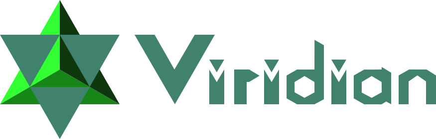

<!--
<!-- Load fonts -- >
<link href="https://fonts.googleapis.com/css?family=Oswald|Open+Sans+Condensed:700|Raleway" rel="stylesheet">
-->

```{r setup, include=FALSE}
knitr::opts_chunk$set(echo = FALSE)
```

## Wirtschaft ist Lebensgrundlage...

<center>

](images/renate-vanaga-2pV2LwPVP9A-unsplash.jpg){style="height: 400px;"}

</center>

<div class="notes">

Wirtschaft (insbes. Landwirtschaft) ist lebensnotwendig, ernährt uns, schafft Wohlstand und Lebensqualität, auch über das bloße Überleben hinaus...

</div>


## ...aber verursacht auch viele Probleme <span style="font-size: 70%; color: gray;">Zerstörung/Verschmutzung</span>

<center style="margin-top: -50px;">

<div style="width: 48%; float: left;">

</span>](images/Grasberg_mine.jpg){style="width: 100%;"}

</div>

<div style="width: 48%; float: right;">

</span>](images/Surface_Mining_Hambach_200800806.jpg){style="width: 100%;"}

</div>

</center>

<div class="notes">

... sie kann auch viel Schaden anrichten.

- Grasberg-Mine: Eine der größten Kupferminen der Welt(?). Große Belastung mit
Schwermetallen, verseuchtes Flusswasser(?). XXX km$^2$ verseuchte Fläche(?).
Ausmaß des Schadens kaum bekannt, da niemand auf das Gelände gelassen wird.
Luftaufnahmen zeigen betongraue Fläche ohne Vegetation.
- Hambach: Einer der größten Braunkohletagebaue der Welt(?). XXX km$^2$ zerstörte
Fläche (Landschaft und Ortschaften unwiederbringlich verloren). Beitrag zu globalen
CO$_2$-Emissionen durch das rheinische Braunkohlerevier: 2%(?). Zerstörung des
ökologisch wertvollen Hambacher Waldes.
- Fakt 1 zu Verschmutzung
- Fakt 2 zu Verschmutzung

</div>

## ...aber verursacht auch viele Probleme <span style="font-size: 70%; color: gray;">Zerstörung/Verschmutzung</span>

<center style="margin-top: -50px;">

<div style="width: 48%; float: left;">

Vorher:

![<span style="font-size: 70%;">Pristine Canadian boreal forest photographed by [...] Garth Lenz, <a href="https://www.cooldavis.org/2012/12/19/the-true-cost-of-oil-images-of-beauty-and-devastation/">Cool Davis</a>, <a href="https://creativecommons.org/licenses/by-nc/3.0/" title="Creative Commons Attribution-NonCommercial 3.0 Unported">CC BY-NC 3.0</a></span>](images/Garth_Lenz-11.jpg){style="width: 100%;"}

</div>

<div style="width: 48%; float: right;">

Nachher:

{style="width: 100%;"}

</div>

</center>

## ...aber verursacht auch viele Probleme <span style="font-size: 70%; color: gray;">Zerstörung/Verschmutzung</span>

<center style="margin-top: -50px;">

](images/oil_sands.jpg){style="width: 80%;"}

</center>

## ...aber verursacht auch viele Probleme <span style="font-size: 70%; color: gray;">Zerstörung/Verschmutzung</span>

<center style="margin-top: -50px;">

](https://www.nationalgeographic.com/content/dam/environment/2019/04/oil-sands-canada/15-oil-sands-canada.adapt.1900.1.jpg){style="width: 80%;"}

</center>

## ...aber verursacht auch viele Probleme <span style="font-size: 70%; color: gray;">Klimakrise</span>

<center style="margin-top: -50px;">

.jpg){style="width: 80%;"}

</center>

## ...aber verursacht auch viele Probleme <span style="font-size: 70%; color: gray;">Klimakrise</span>

<center style="margin-top: -50px;">

](https://projekte.sueddeutsche.de/artikel/politik/was-die-klimakrise-wirklich-bedeutet-e946076/_modules_19_data_background_image_desktopw2880h2880q70-7f648d7643d1cdff.jpg){style="width: 70%;"}

<!-- Auch möglich: Sommer 2019, "In Brasilien stand das Amazonasgebiet in Flammen, Hunderttausende Hektar Wald und Weiden verbrannten."
https://projekte.sueddeutsche.de/artikel/politik/was-die-klimakrise-wirklich-bedeutet-e946076/_modules_22_data_background_image_desktopw2880h2880q70-ec37300df1f5b193.jpg
von https://projekte.sueddeutsche.de/artikel/politik/was-die-klimakrise-wirklich-bedeutet-e946076/
-->

</center>

## ...aber verursacht auch viele Probleme <span style="font-size: 70%; color: gray;">Klimakrise</span>

<center style="margin-top: -50px;">

, von sonora, [CC BY-NC-ND 3.0](https://creativecommons.org/licenses/by-nc-nd/3.0/deed.en)](images/024737-superstorm-sandy.jpg)

</center>

## ...aber verursacht auch viele Probleme <span style="font-size: 70%; color: gray;">Klimakrise</span>

<center style="margin-top: -50px;">

Prognose für Dürre, z.B. aus Lietaer

</center>

<div class="notes">

- Fakt 1 zu Ausmaß des Klimawandels
- Fakt 2 zu verursachten Kosten

</div>

## ...aber verursacht auch viele Probleme <span style="font-size: 70%; color: gray;">Miserable Arbeitsbedingungen</span>

<center style="margin-top: -50px;">

![<span style="font-size: 70%;">Von <a rel="nofollow" class="external text" href="https://www.flickr.com/people/40831205@N02">rijans</a> - <a href="//commons.wikimedia.org/wiki/Flickr" class="mw-redirect" title="Flickr">Flickr</a>: <a rel="nofollow" class="external text" href="https://www.flickr.com/photos/40831205@N02/8731789941">Dhaka Savar Building Collapse</a>, <a href="https://creativecommons.org/licenses/by-sa/2.0" title="Creative Commons Attribution-Share Alike 2.0">CC BY-SA 2.0</a>, <a href="https://commons.wikimedia.org/w/index.php?curid=26051590">Link</a>](images/Dhaka_Savar_Building_Collapse.jpg){style="width: 80%;"}

</center>

## ...aber verursacht auch viele Probleme <span style="font-size: 70%; color: gray;">Miserable Arbeitsbedingungen</span>

<center style="margin-top: -50px;">

 ("Um nicht zu vergessen -- Ein Jahr nach der Tragödie von Rana Plaza"), von scuolabinari, modifiziert, [CC BY-NC 3.0](https://creativecommons.org/licenses/by-nc/3.0/deed.en_US)](images/Rana-Plaza-4.jpg){style="width: 90%;"}

</center>

oder Brand bei Ali Enterprises, z.B. aus Fallbeispiel von lieferkettengesetz.de

<div class="notes">

- Fakt 1 zu Rana Plaza
- Fakt 2 zu Rana Plaza

</div>

## ...aber verursacht auch viele Probleme <span style="font-size: 70%; color: gray;">Nitratbelastung</span>

(Evtl. weglassen.)

<center>

Bild von güllesprühendem Traktor

</center>

<div class="notes">

Beispiel aus näherer Umgebung:

- Fakt 1 zu Nitratbelastung, z.B. Ausmaß
- Fakt 2 zu Nitratbelastung, z.B. zu Kosten der Trinkwasserreinigung

</div>

## Warum passiert das?

<center>

Bild mit Geldscheinen

</center>

<div class="notes">

Durch Unternehmen, die wenig Verantwortung tragen müssen.

- Je rücksichtsloser die Ausbeutung, umso größer der Profit (Rücksichtslosigkeit
  spart Kosten -> Gewinnspanne größer)
- Ausbeutung von Mensch und Natur
- Unternehmen räumem ihren Müll nicht weg, nutzen Natur als kostenlose Deponie
  für CO<sub>2</sub>, giftige Abwässer etc.
- Unternehmen kümmern sich nicht um ihre Angestellten, verlangen ihnen zu viel ab,
  bezahlen sie schlecht
- Andere Menschen leiden darunter oder haben Kosten, um Schäden zu beseitigen
- "Externe" Kosten sind hoch

</div>

## Gerechtigkeit

<center>

Bild mit Justizia

"Verursacherprinzip"

</center>

<div class="notes">

- Gerecht wäre: Wenn Verursacher die Verantwortung tragen müssten
- Wenn externe Kosten von Verursachern bezahlt werden müssten, würde sich
  rücksichtsloses Wirtschaften ökonomisch gar nicht lohnen
- -> Verantwortungsvolles Wirtschaften setzt sich durch, da lukrativer
- -> Schäden entstehen gar nicht erst, externe Kosten fallen nicht an

</div>

## Politik könnte eingreifen, aber...

Bild von gelangweilter Merkel, gelangweiltem Trump o.ä.

Karikatur, die Korruption darstellt

<div class="notes">

- Politik handelt nicht
- Ist teils von schmutzigen Profiten beeinflusst (Lobbyismus)
- Wir können uns auch nicht auf private Unternehmen verlassen, da sie
  ökonomische Interessen verfolgen
- (Selbst Audit-Unternehmen, Fairhandelsorganisationen, etc. können befangen sein)
- Wir brauchen eine gemeinschaftliche, zivilgesellschaftliche, unabhängige Lösung
- -> Ein "Commons"

</div>

## Was können **wir** tun?

<center>

Bild/Karikatur von "schlafendem Riesen"

</center>

<div class="notes">

- Macht der Konsumenten ist "schlafender Riese", braucht mehr Information/Transparenz
- Wir können: Ein gemeinschaftlich getragenes System schaffen, das die Unternehmen
  zwingt, die externen Kosten zu bezahlen (z.B. über eine alternative Währung)
- Drei Schritte:
  1. Transparenzplattform, auf der die Gemeinschaft bestimmt, welche Produkte gut oder schlecht sind
  2. Von Unterstützern getragener Ausgleichsfonds (ohne Beteiligung von Händlern)
  3. Alternative Währung oder Bezahlsystem, das externe Kosten automatisch inkludiert

</div>

## Die Transparenzplattform: "Viridian"

- Ein "Commons" wie Wikipedia
- Unabhängig von politischen oder ökonomischen Interessen
- Wird von keinem kontrolliert
- Jede(r) kann Informationen einsehen
- Jede(r) kann beitragen und bearbeiten
<!-- - Das Wikpedia der Nachhaltigkeitsinfos: Wenn ich wissen will, wie nachhaltig/fair etwas produziert wurde, gucke ich rein -->
- Über Blockchain dezentral organisiert und vor Manipulation geschützt
- Über Peer-Review und Reputationssystem vor unsachlichen Inhalten und Beeinflussung
  geschützt
- Schutz vor Sybil-Attacken durch Identitätscheck ("Permissioned Blockchain")

## Die Transparenzplattform: "Viridian" {.smaller}

- Bündelung sämtlicher Informationen: LCA, Berechnung ext. Kosten, CSR, NGO-Studien,
  Investigativ-Berichte, Gerichtsurteile, Siegel, Whistleblower, ...
- Teilnahme auf mehreren Ebenen: 
    - Information (mit Quellen) hinzufügen
    - Eine Information bewerten/interpretieren
    - Eine Bewertung upvoten/downvoten (zustimmen/ablehnen) und dadurch gewichten
    - (Nur Ergebnisse ansehen)
- "Wer nur wenig Zeit hat, kann trotzdem partizipieren"
- Informationen auf mehreren Ebenen:
    - Produkt
    - Produktkategorie
    - Siegel
    - Unternehmen
- Informationen werden "vererbt"
- "Wenn nur wenig bekannt ist, kann trotzdem im Groben begonnen werden"

## So könnte es aussehen

Bild/Video vom Mockup

## Schlussbemerkung

- Schaffung der "Stiftung Warentest" durch einen Bundestagsbeschluss 1964(?):

> "[...] zweitbeste Lösung [...]"

- Zeit für die "beste Lösung": Eine von der Zivilgesellschaft
  ausgehende, demokratische Verbraucherinformationsplattform

<center>

https://www.viridian-project.org

{style="width: 80%;"}

</center>
